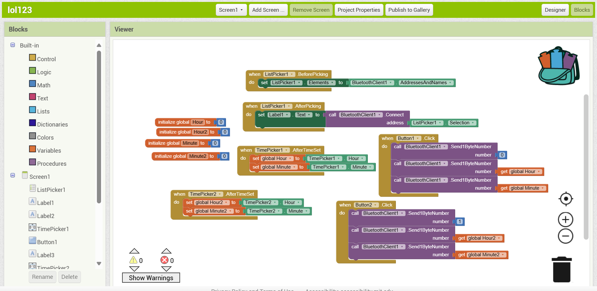
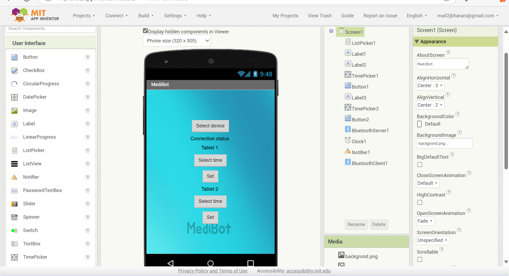

# Medicine Reminder and Dispenser

An Arduino-based project to remind users to take their medicines and dispense the correct dose at scheduled times.

---

## Components
- **Reminders**: Voice and LCD alerts for scheduled medicine times.
- **Dispenser**: Servo-controlled automatic dispensing.
- **Bluetooth**: Remote configuration via a Bluetooth module.

---

## Files in this Repository
- `medicine_reminder_dispenser.ino`
- `lcd_testing.ino`
- `servo_testing.ino`
- `bluetooth_testing.ino`
- `apr33a3_voice_module_testing.ino`

---

## Wokwi Simulation
- Check out [wokwi simulation](https://wokwi.com/projects/363256118100195329)

---

  
# MediBot - Medicine Reminder App

This is a companion mobile app for the **Medicine Reminder and Dispenser** project, built using MIT App Inventor. The app communicates with an Arduino-based dispenser via Bluetooth to set and manage medicine reminders.

---

## Features
- **Bluetooth Connectivity**: Connect to the dispenser and manage settings wirelessly.
- **Time Picker**: Schedule reminders for two different medicines with user-friendly time pickers.
- **Interactive UI**: Easy-to-use interface to set and monitor reminders.

---

## How It Works
1. **Select Device**: Use the `Select Device` button to pair with the Arduino Bluetooth module.
2. **Set Reminder**: Pick a time using the time picker and press `Set` to send it to the dispenser.
3. **Dual Medicine Support**: Schedule reminders for two different medicines independently.

---

## Screenshots

### Blocks Design

### App UI

---

## License
This project is licensed under the MIT License. See the [LICENSE](./LICENSE) file for details.

